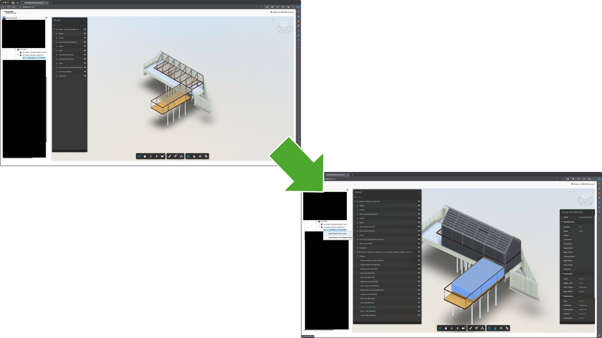

# aps-hubs-browser-with-rooms

Sample demonstrates how to load Revit rooms from linked RVT files into the host RVT.

(Modified from Simple [Autodesk APS](https://aps.autodesk.com) application built by following
the [Hubs Browser](https://aps-tutorials.autodesk.io/tutorials/hubs-browser/) tutorial
from https://aps-tutorials.autodesk.io.)

## Development

### Prerequisites

- [APS application](https://aps.autodesk.com/en/docs/oauth/v2/tutorials/create-app)
- Provisioned access to [BIM 360 Docs](https://aps.autodesk.com/en/docs/bim360/v1/tutorials/getting-started/manage-access-to-docs/)
or Autodesk Construction Cloud
- [Node.js](https://nodejs.org) (we recommend the Long Term Support version)
- Terminal (for example, [Windows Command Prompt](https://en.wikipedia.org/wiki/Cmd.exe)
or [macOS Terminal](https://support.apple.com/guide/terminal/welcome/mac))

### Setup & Run

- Clone this repository
- Install dependencies: `yarn install` or `npm install`
- Setup environment variables:
  - `APS_CLIENT_ID` - your APS application client ID
  - `APS_CLIENT_SECRET` - your APS application client secret
  - `APS_CALLBACK_URL` - URL for your users to be redirected to after they successfully log in with their Autodesk account
    - For local development, the callback URL is `http://localhost:8080/api/auth/callback`
    - For applications deployed to a custom domain, the callback URL is `http://<your-domain>/api/auth/callback` or `https://<your-domain>/api/auth/callback`
    - Do not apst to update the callback URL for your application in https://aps.autodesk.com/myapps as well
  - `SERVER_SESSION_SECRET` - arbitrary phrase used to encrypt/decrypt server session cookies
- Run the server: `yarn start` or `npm start`

> When using [Visual Studio Code](https://code.visualstudio.com),
you can specify the env. variables listed above in a _.env_ file in this
folder, and run & debug the application directly from the editor.

## Troubleshooting

Please contact us via https://aps.autodesk.com/en/support/get-help.

## License

This sample is licensed under the terms of the [MIT License](http://opensource.org/licenses/MIT).
Please see the [LICENSE](LICENSE) file for more details.

## Written by

Eason Kang [in/eason-kang-b4398492/](https://www.linkedin.com/in/eason-kang-b4398492), [Developer Advocacy and Support Team](http://aps.autodesk.com)